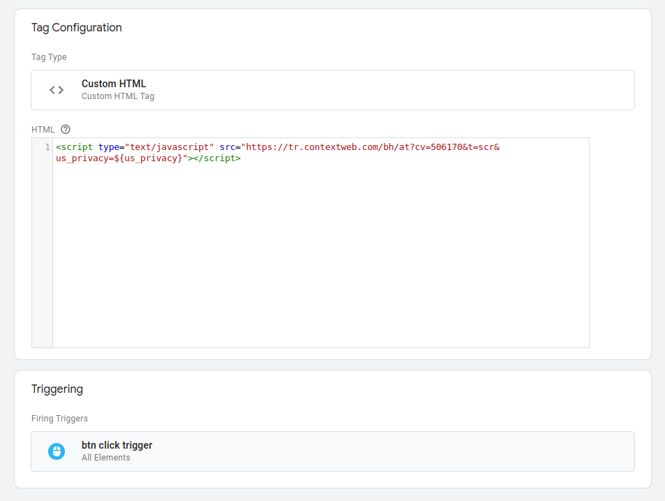
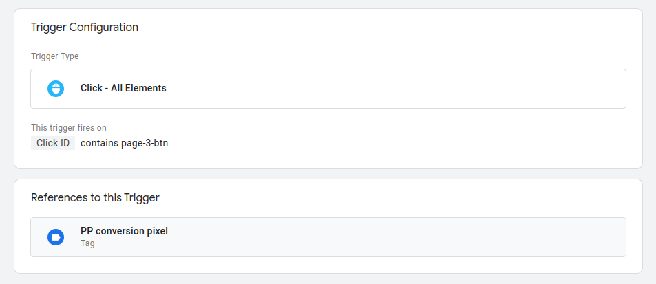
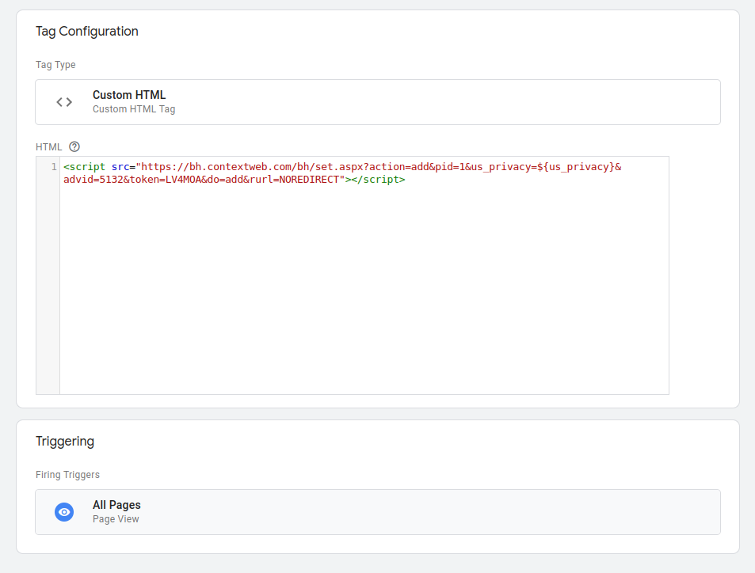

# How to add PulsePoint Pixels in a React website

This is a basic walkthrough of how to fire a pixel using React. When looking
throught the live site:

[https://react-pp-pixels.vercel.app](https://react-pp-pixels.vercel.app/)

This is implemented using the GTM method as this is the method we recommend for
use of development.

The website has 3 main pages, that consist of:

- Home
- Second Page
- Third Page

The routes to these pages are built using React Router in its basic form, a good
tutorial can be found on the
[React Router Site](https://reactrouter.com/en/6.14.1/start/tutorial) all routes
are created in `src/main.jsx`

All routes are created in `main.jsx` here is a code snippet from our router
configuration.

```js
const router = createBrowserRouter([
  {
    path: '/',
    element: <App />,
  },
  {
    path: '/secondpage',
    element: <SecondPage />,
  },
  {
    path: '/thirdpage',
    element: <ThirdPage />,
  },
  {
    path: '/',
    element: <App />,
    errorElement: <ErrorPage />,
  },
])
```

You shouldn't have to worry about routes, as these would be in place already
unless you're building your website from scratch. The above is just an example
to explain the way this test environment was created.

# [Option 1](https://github.com/mrpbennett/react-pp-pixels/tree/main/option-1)

This is by far the simplest way to implement one of our pixels using React. Here
we're going to be using the
[GTM React Module](https://www.npmjs.com/package/react-gtm-module) using this
allows you to pass many options within a dataLayer.

To install the module you can run

```bash
npm i react-gtm-module
```

Within the root of your project, this will install the module for you to use.

Next, we need to initialize the module we do this by adding the below into your
`main.jsx` file or the file that belongs to the root of your project like so,
all you need is to know your GTM ID and replace `GTM-XXXXX` with your own.

```jsx
import React from 'react'
import ReactDOM from 'react-dom/client'
import {createBrowserRouter, RouterProvider} from 'react-router-dom'
import App from '../src/App'
import './index.css'

...
import TagManager from 'react-gtm-module'

const tagManagerArgs = {
  gtmId: 'GTM-XXXXXX',
}

TagManager.initialize(tagManagerArgs)

...

ReactDOM.createRoot(document.getElementById('root')).render(
  <React.StrictMode>
    <RouterProvider router={router} />
  </React.StrictMode>
)
```

Once the above is in place and we have initialized the GTM module in our root
file, we can then go ahead and place it throughout our site. Let's start with
our conversion pixel as an example.

### Conversion Pixel

This is what our conversion pixel looks like, this can be placed anywhere you
want to track a conversion.

```html
<script
  type="text/javascript"
  src="https://tr.contextweb.com/bh/at?cv=123456&t=scr&us_privacy=${us_privacy}"
></script>
```

For this example, we're going to use a button, where we're able to track a
button click firing off the pixel. We first need to create a button component, I
have created one
[here](https://github.com/mrpbennett/react-pp-pixels/blob/main/option-1/src/components/button.jsx)

The button below is what we call a reusable component, this is because we're
passing 3 props which allow us to change their attributes for our needs, but
this allows us to use the same button throughout the site. The props we have
are:

- id: Allows you to give an individual ID to allow you to target it with GTM.
- page_url: Allows you to specify the url that this button links too
- children: This prop allows you to enter anything you want as button text.

```jsx
import React from 'react'
import TagManager from 'react-gtm-module'
import {Link} from 'react-router-dom'

export default function Button({id, page_url, children}) {
  const handleClick = () => {
    TagManager.dataLayer({
      dataLayer: {
        event: 'button_click',
      },
    })
  }

  return (
    <Link to={page_url}>
      <button
        id={id}
        onClick={handleClick}
        className="w-full bg-blue-500 hover:bg-blue-700 text-white  py-2 px-4 rounded-md"
      >
        {children}
      </button>
    </Link>
  )
}
```

With the above button, you can see we have implemented our
`TagManager.dataLayer()` here we're able to pass different keys and values to
capture what we need. Here we're using the `event` key to capture a
`button_click`.

This is placed in our click handler `handleClick`

```jsx
const handleClick = () => {
  TagManager.dataLayer({
    dataLayer: {
      event: 'button_click',
    },
  })
}
```

This click handler is then called on the `OnClick` prop within our button. There
are many different event types which can be found
[here](#gtm-react-module-event-types)

Now have our button all coded up we can then place this anywhere within our
other page components we can do this by importing the button component into the
page we used to use the button. In this example, we have added the button on our
first page, and linked the button to our third page, this is how we have coded
this up.

```jsx
import Button from '../src/components/button'
...

  return (
    <Layout>
        ...
            <Button id="page-3-btn" page_url="/thirdpage">
                Fire conversion pixel...
            </Button>
        ...
    </Layout>
  )
}

export default App

```

Now we have our button coded up where we want it. Let's set up GTM to fire our
conversion pixel on button click.

First, we need to set up a custom HTML and trigger that on an "All Clicks" event
but with one caveat, we need to include an ID. This is how it's done.



Here you can see what we have added our conversion pixel as a custom HTML tag,
we're trigging this tag like so:



Here you're able to notice the "This trigger fires on" **Click ID**
`contains page-3-btn` if we look back at our button and look at the `id` prop we
can see that we're passing `page-3-btn` into the `id` prop.

```jsx
<Button id="page-3-btn"  ... >...</Button>
```

Once your changes to your GTM have been pushed with your new tag and trigger
setup. The button we implemented will start firing the conversion pixel on
button click.

### Retargeting pixel

To implement our retargeting pixel this is much more straightforward. We just
need to be placing our `TagManager.dataLayer()` function anywhere we want to
capture. Let's see how we can easily do this on a page. Here is how we have done
this for our main page. It's the same throughout with some little tweaks

```jsx
import TagManager from 'react-gtm-module'
...

function App() {
  TagManager.dataLayer({
    dataLayer: {
      event: 'page_view',
      page: 'home',
    },
  })

  ...
```

We looked at the `event` key for our button, and we have included another called
`page` This will allow you to send into GTM which page the pixel was fired on.
For example, we have the same code on our second page but we're passing `page-2`
into the page key.

As an example

```jsx
import React from 'react'
import TagManager from 'react-gtm-module'
import Layout from '../layouts/MainLayout'

const PageTwo = () => {
  TagManager.dataLayer({
    dataLayer: {
      event: 'page_view',
      page: 'page-2',
    },
  })

  return <Layout>Second page</Layout>
}

export default PageTwo
```

To implement this within GTM we simply add another Custom HTML tag with a
trigger of `All Pages` this will fire on all pages, but when we pass the `page`
key into our data layer we will be able to track which page it fired on.



And that's about it...again please bare in mind this is super basic way to
implement the GTM React module, but this should give you a good starting point.

# Option 2

Non GTM

## GTM React Module Event Types

The react-gtm-module library allows you to push various types of events to the
Google Tag Manager (GTM) data layer. Here are some commonly used event types:

Page View: Event Name: `page_view` Description: Indicates that a new page has
been viewed or loaded.

Custom Event: Event Name: You can define a custom event name of your choice.
Description: Used to track custom interactions or actions on your website.

Button Click: Event Name: `button_click` (or any custom name you choose)
Description: Tracks when a button is clicked.

Form Submit: Event Name: `form_submit` (or any custom name you choose)
Description: Tracks when a form is submitted.

Link Click: Event Name: `link_click` (or any custom name you choose)
Description: Tracks when a link is clicked.

Video Play: Event Name: `video_play` (or any custom name you choose)
Description: Tracks when a video starts playing.

Video Pause: Event Name: `video_pause` (or any custom name you choose)
Description: Tracks when a video is paused.

Video Complete: Event Name: `video_complete` (or any custom name you choose)
Description: Tracks when a video playback is completed.

These are just a few examples of event types you can use with react-gtm-module.
You can define your own custom event names based on the specific interactions or
actions you want to track in your application.

Remember to configure the corresponding tags, triggers, and variables in Google
Tag Manager based on the event types you`re using.
